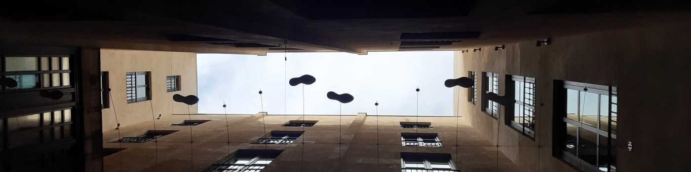

<div class="header-image">
  
</div>


Welcome to my personal website!

<p align="justify">
Lorenzo Belli is a PhD student in the **Department of Political and Social Sciences** at **Universitat Pompeu Fabra** (UPF) and member of the Sociodemography Research Group ([DEMOSOC](https://www.upf.edu/web/demosoc)). He holds a bachelor’s degree in Sociology from the Università di Bologna, a master’s degree in Sociology and Social Research with honors from the Università di Trento, and a master’s degree in Sociology and Demography from UPF.

He is currently involved with the team for the project *"Contextualized Multi-Intervention Strategies to Break the Vicious Cycle of Intimate Partner Violence"*, funded by the Agencia Estatal de Investigación and cofunded by the European Union.

His main research interests focus on social and **gender inequalities**, as well as **gender-based violence**. He has expertise in both qualitative and quantitative methodologies. This site presents his research, publications, and academic work. Visitors are welcome to explore and get in touch!
</p>


```{r me, echo=FALSE, out.width='50%', fig.align='center'}
knitr::include_graphics("images/image-me.jpg")
